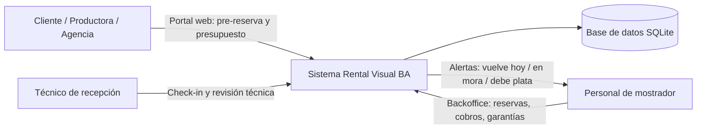
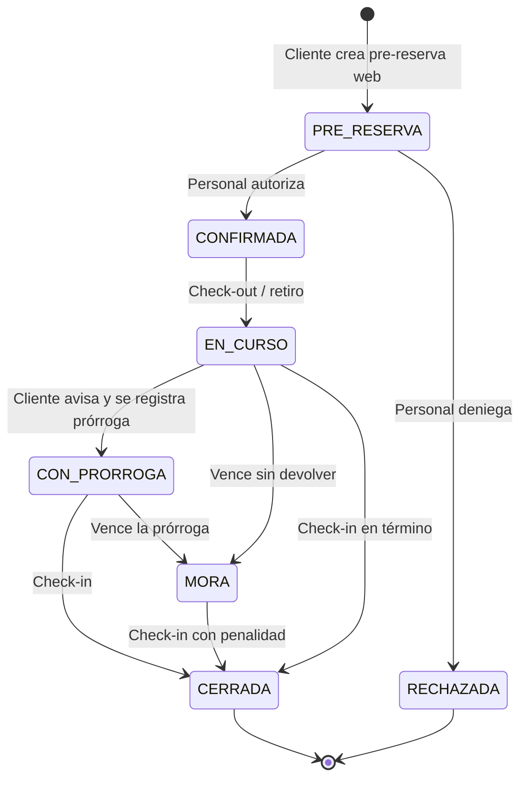
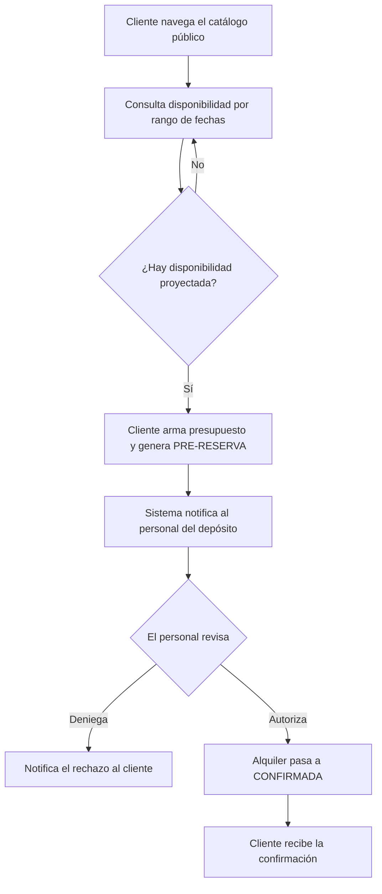
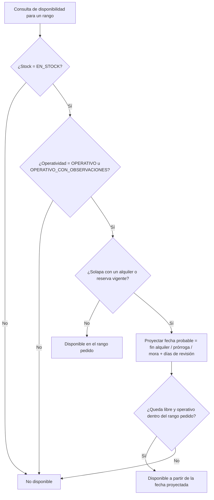
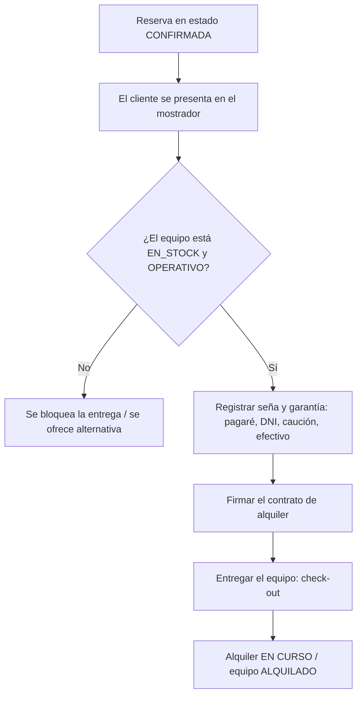
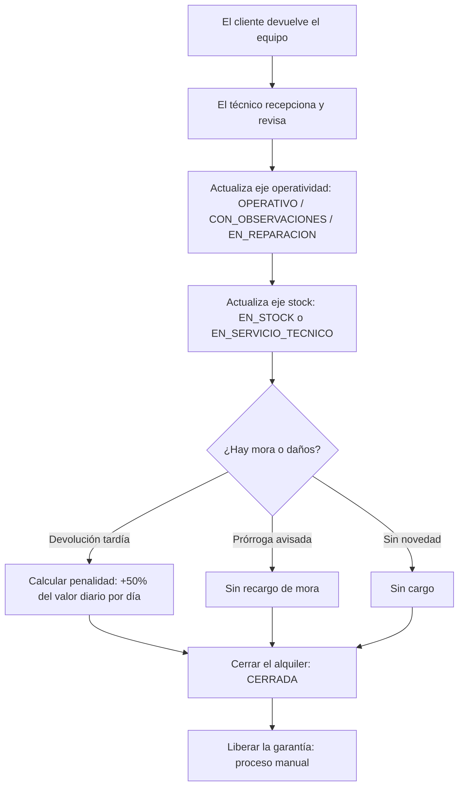
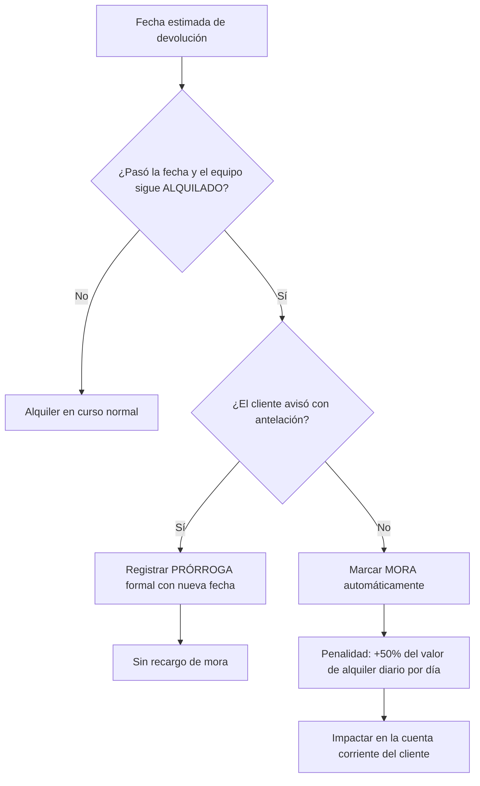
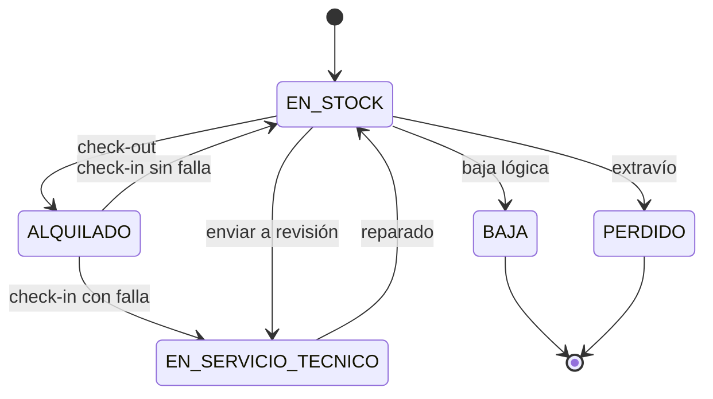
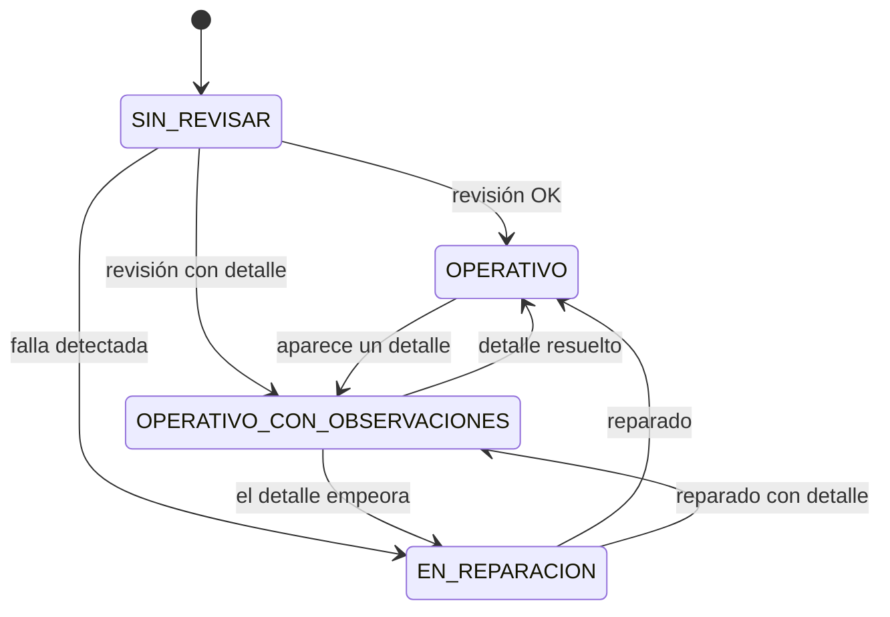

# 07 — Flujos y Procesos del Sistema

Caso "Rental Visual BA" — Prácticas Pre Profesionales 2026.

Este documento es el **entregable de flujo** solicitado por el cliente: representa gráficamente cómo opera el sistema, de punta a punta, desde la pre-reserva web hasta la devolución del equipo, incluyendo disponibilidad, mora y prórrogas. Es la contraparte visual de los requerimientos (`01-requerimientos.md`): cada flujo referencia los RF/RN que implementa.

> Los diagramas usan sintaxis **Mermaid**. Se visualizan directamente en GitHub / VS Code y en la versión `07-flujos-y-procesos.html` (exportable a PDF).

## Índice de flujos

| # | Flujo | Qué responde |
|---|-------|--------------|
| 1 | Contexto y actores | ¿Quién usa el sistema y para qué? |
| 2 | Ciclo de vida de una reserva/alquiler | ¿Qué estados atraviesa un alquiler? |
| 3 | Pre-reserva web y autorización | ¿Cómo pide un cliente y cómo autoriza el personal? |
| 4 | Motor de disponibilidad | ¿Cómo se evita la doble reserva? |
| 5 | Check-out (retiro) | ¿Cómo sale el equipo del depósito? |
| 6 | Check-in (devolución + revisión técnica) | ¿Cómo vuelve y cómo se controla su estado? |
| 7 | Mora y prórroga | ¿Qué pasa si no devuelve a tiempo? |
| 8 | Estados doble eje | ¿En qué estado puede alquilarse un equipo? |

---

## 1. Contexto y actores

El sistema es una única plataforma con dos entornos (Portal Cliente y Backoffice) sobre una misma base de datos normalizada. Tres actores interactúan con él.

**Referencias:** RF-20 a RF-25, RNF-04.

---

## 2. Ciclo de vida de una reserva / alquiler

Estados oficiales: `PRE-RESERVA` → `CONFIRMADA` → `EN CURSO` → `CERRADA`, con ramas a `MORA` y `CON PRÓRROGA`.

**Referencias:** RF-08, RN-2, RN-4, RN-6.

---

## 3. Pre-reserva web y autorización del personal

El portal **nunca** confirma un alquiler por sí solo: genera una pre-reserva que el personal debe autorizar o denegar.

**Referencias:** RF-09, RF-10, RF-13, RF-23, RN-6.

---

## 4. Motor de disponibilidad (evitar la doble reserva)

Es el corazón del sistema. Combina los dos ejes de estado con la proyección de disponibilidad probable (fin de alquiler / prórroga / mora + ventana de revisión técnica).

**Referencias:** RF-05, RF-06, RF-07, RN-1, RN-7.

---

## 5. Check-out (retiro del equipo)

**Referencias:** RF-03, RF-11, RF-17, RN-1.

---

## 6. Check-in (devolución con revisión técnica)

El técnico de recepción actualiza **ambos** ejes de estado en cada devolución. La garantía se libera siempre de forma **manual**.

**Referencias:** RF-04, RF-12, RF-16, RF-18, RN-3, RN-5.

---

## 7. Mora y prórroga

Regla de oro: si el cliente **avisó** con antelación, se registra prórroga formal y **no** se cobra recargo. Si no avisó, la mora se marca sola y se aplica la penalidad.

**Referencias:** RF-14, RF-15, RF-16, RF-19, RN-2, RN-3, RN-4.

---

## 8. Estados doble eje

### Eje 1 — Stock / ubicación

### Eje 2 — Operatividad técnica

> **Regla clave:** un equipo solo se alquila si está `EN_STOCK` **y** `OPERATIVO` (o `OPERATIVO_CON_OBSERVACIONES` informadas y aceptadas por el cliente). Estar en stock no es lo mismo que funcionar.

**Referencias:** RF-02, RF-03, RN-1.
