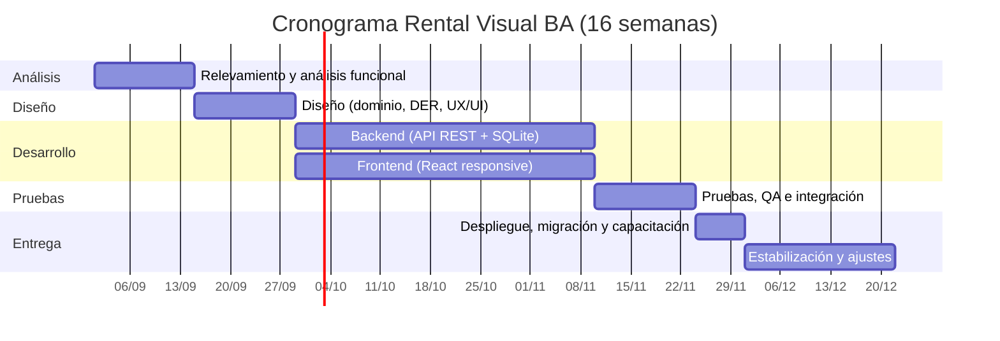

# 08 — Presupuesto de Tiempo y Costos

Caso "Rental Visual BA" — Prácticas Pre Profesionales 2026.

Documento de presupuesto solicitado por el cliente. Estima el **esfuerzo (tiempo)** y el **costo** del desarrollo del MVP descripto en `01-requerimientos.md`, para un equipo de **4 (cuatro) integrantes**, más los **costos operativos de infraestructura** del primer año.

> **Moneda:** pesos argentinos (ARS). **Tarifa de referencia:** ARS 15.000 / hora-hombre (ver justificación en la sección 3). Los valores son parametrizables: si el equipo o el cliente acuerdan otra tarifa, se recalcula con la tabla de sensibilidad de la sección 7.

---

## 1. Resumen ejecutivo

| Concepto | Valor |
|---|---|
| Duración del proyecto | **16 semanas** (~4 meses) |
| Equipo | **4 integrantes** |
| Dedicación | 15 h/semana por integrante (60 h/semana de equipo) |
| Esfuerzo total | **960 horas-hombre (HH)** |
| Tarifa de referencia | ARS 15.000 / HH |
| **Costo de desarrollo** | **ARS 14.400.000** |
| **Infraestructura año 1** | **ARS 500.000** |
| **TOTAL primer año** | **ARS 14.900.000** |

---

## 2. Equipo y dedicación

| Rol | Perfil | Personas | Dedicación |
|---|---|---|---|
| Analista funcional / líder técnico | Semi-senior | 1 | 15 h/sem |
| Desarrollador backend (Node/Express + SQLite) | Junior/Semi | 1 | 15 h/sem |
| Desarrollador frontend / UX-UI (React) | Junior/Semi | 1 | 15 h/sem |
| QA / testing y documentación | Junior | 1 | 15 h/sem |
| **Total** | | **4** | **60 h/sem** |

> Los roles se proponen como referencia; el equipo de 4 puede rotarlos según disponibilidad. La estimación no cambia porque el cálculo se hace sobre horas-hombre totales.

---

## 3. Tarifa de referencia (valor hora)

Se toma como base la mediana salarial bruta del sector tecnológico en Argentina (Encuesta de Sueldos 2026.1, Sysarmy) y se aplica un margen freelance para cubrir tiempo no facturable, impuestos y overhead (~30–40%).

| Rol | Tarifa/hora (ARS) | Peso en el proyecto |
|---|---|---|
| Analista funcional / líder técnico | 18.000 | 25 % |
| Desarrollador full-stack | 14.000 | 45 % |
| Diseño UX/UI | 13.000 | 15 % |
| QA / testing | 11.000 | 15 % |
| **Promedio ponderado** | **≈ 14.400** | 100 % |

Se adopta **ARS 15.000 / HH** como tarifa de referencia redondeada para todo el proyecto.

---

## 4. Estimación de tiempo (EDT / WBS)

| # | Fase | Semanas | Dedicación | Horas-hombre | Costo (ARS) |
|---|---|---|---|---|---|
| 1 | Relevamiento y análisis funcional | 1–2 | 4 × 15 h | 120 | 1.800.000 |
| 2 | Diseño (modelo de dominio, DER, arquitectura, UX/UI) | 3–4 | 4 × 15 h | 120 | 1.800.000 |
| 3 | Desarrollo (backend + frontend en paralelo) | 5–10 | 4 × 15 h | 360 | 5.400.000 |
| 4 | Pruebas, QA e integración | 11–12 | 4 × 15 h | 120 | 1.800.000 |
| 5 | Despliegue, migración de datos y capacitación | 13 | 4 × 15 h | 60 | 900.000 |
| 6 | Estabilización y ajustes post-feedback (buffer) | 14–16 | 4 × 15 h | 180 | 2.700.000 |
| | **Total** | **16** | | **960** | **14.400.000** |

La documentación y la gestión del proyecto están distribuidas dentro de cada fase (no se facturan como línea aparte).

### Cronograma

---

## 5. Costos de infraestructura (año 1)

| Concepto | Detalle | Costo anual (ARS) |
|---|---|---|
| Dominio `.com.ar` | Registro/renovación NIC.ar | 20.000 |
| Hosting VPS | 2 vCPU / 2 GB (Node + SQLite), ARS 30.000/mes | 360.000 |
| Certificado SSL/TLS | Let's Encrypt | 0 |
| Backup automático en nube | ARS 10.000/mes | 120.000 |
| **Subtotal** | | **500.000** |

> El stack elegido (SQLite + Node/Express + React) permite correr todo en un único servidor pequeño, sin costos de licencias de base de datos ni de plataformas SaaS.

---

## 6. Forma de pago propuesta (hitos)

| Hito | % | Monto (ARS) |
|---|---|---|
| Firma / inicio del proyecto | 30 % | 4.470.000 |
| Entrega del MVP funcional (fin del desarrollo) | 30 % | 4.470.000 |
| Entrega final + capacitación | 30 % | 4.470.000 |
| Retención de garantía (a 30 días de la puesta en marcha) | 10 % | 1.490.000 |
| **Total** | **100 %** | **14.900.000** |

---

## 7. Análisis de sensibilidad

Variación del total según la tarifa hora-hombre adoptada (manteniendo las 960 HH y la infraestructura):

| Tarifa (ARS/HH) | Costo desarrollo (ARS) | + Infra (ARS) | **Total año 1 (ARS)** |
|---|---|---|---|
| 12.000 | 11.520.000 | 500.000 | **12.020.000** |
| **15.000 (referencia)** | **14.400.000** | **500.000** | **14.900.000** |
| 18.000 | 17.280.000 | 500.000 | **17.780.000** |

---

## 8. Alcance, supuestos y exclusiones

**Incluido en el presupuesto**
- Los 5 módulos del MVP: Inventario, Calendario/Disponibilidad, Check-out/Check-in, Mora/Prórrogas/Penalidades y Catálogo Web con pre-reservas.
- Migración y normalización de los datos del Excel actual (`Caso_4_Audiovisual_Rental_Datos_Equipos.xlsx`).
- Capacitación al personal del depósito y documentación de uso.
- Infraestructura del primer año (hosting, dominio, backup, SSL).

**Supuestos**
- Dedicación promedio de 15 h/semana por integrante durante 16 semanas.
- El cliente provee los datos reales y valida cada entrega en un plazo máximo de 5 días hábiles.
- Un único idioma (español) y una única moneda visible en el sistema.

**Excluido (cotizable por separado)**
- Mantenimiento y soporte posterior a los 30 días de la puesta en marcha.
- Integración con pasarelas de pago online, facturación electrónica o AFIP.
- Apps móviles nativas (la entrega es web responsive).
- Funcionalidades fuera del MVP (ej. reportes avanzados, multi-sucursal).
